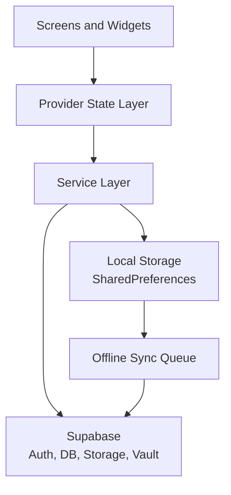

# CrimiReview

CrimiReview is a Flutter app for Criminology board exam preparation: adaptive quiz practice driven by Bayesian Knowledge Tracing, an admin panel for managing question content, progress tracking, daily challenges, flashcards, and cloud sync via Supabase.

## Current App Flow (August 2026)

### Launch and Routing

```text
App start
	-> Initialize services (storage, supabase, admin role check, notifications, feedback, ML, connectivity, offline sync)
	-> Splash
	-> Onboarding check
	-> Auth check
	-> Onboarding / Auth / Home
```

### Authentication

- Sign up: a 6-digit email code (generated, verified, and emailed entirely server-side — see **Security** below), then the Supabase account is created and signed in.
- Sign in merges local and cloud progress and handles account switching on shared devices.
- Forgot password: the same server-side code flow, then a Supabase RPC (`reset_user_password`) applies the new password.
- **Dashboard setting required:** Authentication → Providers → Email → turn **off** "Confirm email". This app's own code-verification step replaces Supabase's built-in confirmation email; leaving both on causes sign-in to fail right after a successful signup.

### Main Navigation

Five bottom tabs:

- **Home:** daily challenge card, study modules, profile shortcut, leaderboard shortcut.
- **Quiz:** subjects → difficulty lock/unlock → study notes → quiz → results. Item selection goes through `QuestionSelectionService` (unseen-first, weighted toward weak topics per the BKT model in `MasteryService`) so a retry never repeats the same set.
- **Cards:** `FlashcardsHomeScreen` (subject picker) → `FlashcardScreen` (swipe-to-review deck for that subject), both reading from `QuestionRepository`.
- **Progress:** stats, streak, subject breakdown, achievements entry.
- **Settings:** theme, notifications/sound/haptics, profile, password, sign in/out, and (for admins only) the **Admin Panel**.
- **Admin Panel** *(visible only when the signed-in account has `role = 'admin'`)*: dashboard of content/student stats, question bank CRUD, and a read-only student mastery monitor. See `supabase_schema_v2.sql` section 13 for how to promote an account.

## Architecture Overview



Layer summary:

- **UI:** screens and reusable widgets in `lib/screens` and `lib/widgets`, including `lib/screens/admin/` for the admin panel.
- **State:** Provider-managed notifiers for adaptive learning, theme, connectivity, and offline sync.
- **Services:** business logic for auth, storage, quiz logic, ML, notifications, and email verification. Content-specific services:
  - `QuestionRepository` — the single source of every quiz question (Supabase `public.questions`, with an offline SharedPreferences snapshot). There is **no hardcoded question content anywhere in this app.**
  - `QuestionSelectionService` — picks which questions a learner sees next: unseen-first, weighted toward the topics with the lowest modeled mastery, recycling least-seen items only once a pool is exhausted.
  - `MasteryService` — Bayesian Knowledge Tracing (Corbett & Anderson, 1995) per-topic learner model; decides whether a topic is mastered or needs to repeat.
  - `ExplanationService` — guarantees a wrong answer always comes with a specific, non-empty reason.
  - `AdminService` — question CRUD, student mastery overview, audit log; gated by the same `is_admin()` function the database's row-level security uses.
- **Data:** local persistence in SharedPreferences and cloud persistence in Supabase (Postgres + Auth + Storage + Vault for secrets).
- **Sync:** offline operations are queued locally and flushed when connectivity is restored.

## Setup on New Laptop (Windows)

### 1. Install Flutter SDK

```bash
# Download Flutter SDK
https://docs.flutter.dev/get-started/install/windows

# Extract to C:\flutter

# Add to System PATH:
C:\flutter\bin
```

### 2. Install Android SDK (Command Line Only)

```bash
# Download Command Line Tools from:
https://developer.android.com/studio#command-line-tools-only

# Extract to C:\Android\cmdline-tools\latest

# Add to System PATH:
C:\Android\cmdline-tools\latest\bin
C:\Android\platform-tools

# Install required SDK components:
sdkmanager "platform-tools" "platforms;android-34" "build-tools;34.0.0"

# Accept licenses:
flutter doctor --android-licenses
```

### 3. Set Environment Variables

```bash
# Add these to System Environment Variables:
ANDROID_HOME = C:\Android
ANDROID_SDK_ROOT = C:\Android
```

### 4. Verify Setup

```bash
flutter doctor
```

All checks should pass.

## Run Locally

```bash
cd crimireview
flutter pub get
flutter run
```

Optional:

```bash
# Run tests
flutter test

# Run in release mode on connected device
flutter run --release
```

## Project Structure

```text
lib/
├── main.dart              # App entry point
├── models/                # Data models (Question, Mastery, AnswerFeedback, ...)
├── screens/                # UI screens
│   └── admin/              # Admin panel (question CRUD, student monitor)
├── services/               # Business logic — question repository, adaptive
│                            # learning (BKT), admin, auth, sync, ML
├── utils/                  # Utilities
└── widgets/                # Reusable widgets
```

There is no `lib/data/` anymore — question content used to be compiled into the app there (`questions_database.dart`, 6045 lines; `question_bank.dart`, 968 lines), which is exactly what panel note 7 flagged ("do NOT put your questions in your code"). Both files were deleted once `daily_challenge_screen.dart` and `flashcard_screen.dart` — the last two screens still reading from them — were migrated to `QuestionRepository`. Every question now lives in `public.questions` in Supabase, authored through the Admin Panel, bulk-imported, or auto-generated (see `supabase_schema_v2.sql` sections 5–6 for the generation templates).

## Supabase Setup

Project URL:

```text
https://wbhobbehgqlzfborscvx.supabase.co
```

Apply these SQL files **in this exact order**, in the Supabase SQL Editor:

1. `supabase_schema.sql` — core tables (profiles, quiz results, achievements, password reset RPC), auto-profile trigger, avatar storage bucket.
2. `supabase_email_verification.sql` — creates the `email_verifications` table (this file's own RLS policies get replaced by step 3 — leave them, they're harmless once step 3 runs).
3. **`supabase_security_fixes.sql`** — locks `email_verifications` and `password_resets` down to zero direct client access, and moves code generation/verification/emailing entirely server-side. **Read this file's own header before running it** — it requires rotating the Resend API key and storing the new one in Supabase Vault first. Skipping this file leaves both tables readable by anyone with the app's public anon key.
4. `supabase_schema_v2.sql` — the question bank (`public.questions`), the admin role + `is_admin()`, Automatic Item Generation tables, Bayesian Knowledge Tracing state (`topic_mastery`), question exposure tracking, and the admin audit log. Section 13 of this file explains how to promote your account to admin.
5. `supabase_seed_questions.sql` *(optional)* — 759 questions migrated out of the old hardcoded Dart files, ready to seed the bank so it isn't empty on first run. Regenerate with `dart run tools/export_questions_to_sql.dart` if the source files still existed — they don't anymore, so this script is now historical.

Core tables used by the app:

- `user_profiles` (includes `role`: `student` | `admin`)
- `quiz_results`, `user_progress`, `daily_challenge_scores`, `user_achievements`
- `password_resets`, `email_verifications` (server-side access only, see step 3 above)
- `questions`, `question_templates`, `concept_bank`, `topic_mastery`, `question_exposure`, `admin_audit_log`

### Security notes

- The Supabase **anon key** in `lib/services/supabase_service.dart` is meant to be public — access control lives entirely in Postgres Row Level Security, not in keeping that key secret.
- The **Resend API key** must live only in Supabase Vault (`supabase_security_fixes.sql` section 0), never in Dart source. If you ever find a Resend key hardcoded in this codebase again, rotate it immediately — it's readable by anyone who decompiles the built app.
- Before `supabase_security_fixes.sql` is run on a project, `email_verifications` and `password_resets` are readable by any anonymous request. Run it before shipping a build pointed at that project.

## Build Commands

```bash
# Debug APK
flutter build apk --debug

# Release APK
flutter build apk --release

# App Bundle (for Play Store)
flutter build appbundle --release

# Clean build
flutter clean
flutter pub get
flutter build apk --release
```

APK output:

```text
build/app/outputs/flutter-apk/app-release.apk
```
