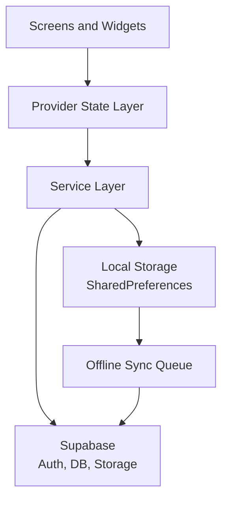

# CrimiReview

CrimiReview is a Flutter app for Criminology board exam preparation with adaptive quiz practice, progress tracking, daily challenges, and cloud sync.

## Current App Flow (May 2026)

### Launch and Routing

```text
App start
	-> Initialize services (storage, supabase, notifications, feedback, ML, connectivity, offline sync)
	-> Splash
	-> Onboarding check
	-> Auth check
	-> Onboarding / Auth / Home
```

### Authentication

- Sign up uses email OTP verification first, then creates/signs in Supabase account.
- Sign in merges local and cloud progress and handles account switching on shared devices.
- Forgot password uses OTP + Supabase RPC password reset.

### Main Navigation

- Home tab: daily challenge card, study modules, profile shortcut, leaderboard shortcut.
- Quiz tab: subjects -> difficulty lock/unlock -> study notes -> quiz -> results.
- Progress tab: stats, streak, subject breakdown, achievements entry.
- Settings tab: theme, notifications/sound/haptics, profile, password, sign in/out.

Note: `flashcard_screen.dart` exists but currently has no active navigation entry.

## Architecture Overview



Layer summary:

- UI: screens and reusable widgets in lib/screens and lib/widgets.
- State: Provider-managed notifiers for adaptive learning, theme, connectivity, and offline sync.
- Services: business logic for auth, storage, quiz logic, ML, notifications, and email verification.
- Data: local persistence in SharedPreferences and cloud persistence in Supabase.
- Sync: offline operations are queued locally and flushed when connectivity is restored.

## Setup on New Laptop (Windows)

### 1. Install Flutter SDK

```bash
# Download Flutter SDK
https://docs.flutter.dev/get-started/install/windows

# Extract to C:\flutter

# Add to System PATH:
C:\flutter\bin
```

### 2. Install Android SDK (Command Line Only)

```bash
# Download Command Line Tools from:
https://developer.android.com/studio#command-line-tools-only

# Extract to C:\Android\cmdline-tools\latest

# Add to System PATH:
C:\Android\cmdline-tools\latest\bin
C:\Android\platform-tools

# Install required SDK components:
sdkmanager "platform-tools" "platforms;android-34" "build-tools;34.0.0"

# Accept licenses:
flutter doctor --android-licenses
```

### 3. Set Environment Variables

```bash
# Add these to System Environment Variables:
ANDROID_HOME = C:\Android
ANDROID_SDK_ROOT = C:\Android
```

### 4. Verify Setup

```bash
flutter doctor
```

All checks should pass.

## Run Locally

```bash
cd crimireview
flutter pub get
flutter run
```

Optional:

```bash
# Run tests
flutter test

# Run in release mode on connected device
flutter run --release
```

## Project Structure

```text
lib/
├── main.dart              # App entry point
├── data/                  # Question database
├── models/                # Data models
├── screens/               # UI screens
├── services/              # Business logic
├── utils/                 # Utilities
└── widgets/               # Reusable widgets
```

## Supabase Setup

Project URL:

```text
https://wbhobbehgqlzfborscvx.supabase.co
```

Apply SQL setup files in this order:

1. `supabase_schema.sql`
2. `supabase_email_verification.sql`

Core tables used by the app:

- user_profiles
- quiz_results
- user_progress
- daily_challenge_scores
- user_achievements
- password_resets
- email_verifications

## Build Commands

```bash
# Debug APK
flutter build apk --debug

# Release APK
flutter build apk --release

# App Bundle (for Play Store)
flutter build appbundle --release

# Clean build
flutter clean
flutter pub get
flutter build apk --release
```

APK output:

```text
build/app/outputs/flutter-apk/app-release.apk
```
